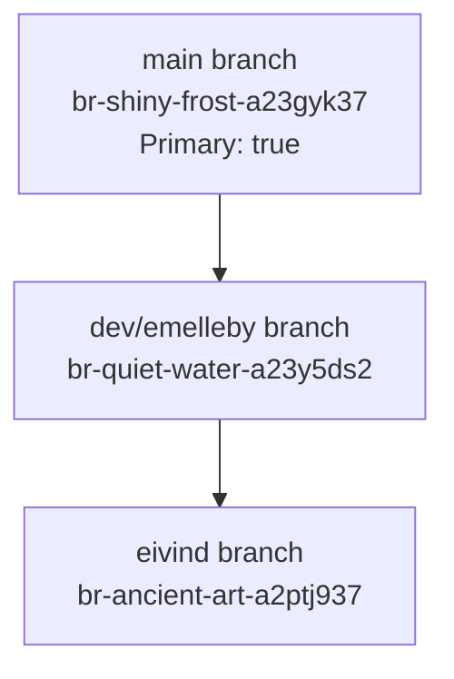

# EcoExpense Database Structure

## Branch Hierarchy

## Data Comparison

| Table         | dev/emelleby | eivind | Difference |
|---------------|--------------|--------|------------|
| User          | 7           | 3      | -4         |
| Organization  | 4           | 3      | -1         |
| Project       | 6           | 1      | -5         |
| Expense       | 20          | 15     | -5         |

## Detailed Branch Information

### dev/emelleby Branch

#### Organizations
- LodeStar AS (891755562)
- Scope321 (927089068)
- Test org (789456123)
- Norges seilforbund (123456789)

#### Users
1. emelleby (ACTIVE, LodeStar)
2. emelleby2 (ACTIVE, Scope321)
3. perris (ACTIVE)
4. onor (ACTIVE)
5. show (INACTIVE)
6. piggy (INACTIVE)
7. onecom (INACTIVE)

### eivind Branch

#### Organizations
- LodeStar AS (891755562)
- Scope321 (927089068)
- Test Organization (854555545)

#### Users
1. emelleby (ACTIVE, LodeStar)
2. emelleby2 (INACTIVE, Scope321)
3. usama (INACTIVE)

## Schema Structure
Both branches share identical schema with the following tables:

- Expense
- ExpenseCategory
- Organization
- Project
- Receipt
- Sector
- Supplier
- Trip
- User
- _prisma_migrations

Each table has its corresponding indexes and sequences. The schema includes a utility function `show_db_tree`.

## Branch Creation Timeline
- Main branch created: Nov 12, 2024
- dev/emelleby branch created: Dec 9, 2024 (from main)
- eivind branch created: Dec 9, 2024 (from dev/emelleby)

## Activity Statistics
- dev/emelleby branch:
  - CPU usage: 8030 seconds
  - Active time: 31352 seconds
  - Written data: 174,584 bytes
  - Data transfer: 1,416,736 bytes

- eivind branch:
  - CPU usage: 0 seconds
  - Active time: 0 seconds
  - Written data: 0 bytes
  - Data transfer: 0 bytes

This suggests that all development activity has been happening in the dev/emelleby branch.
